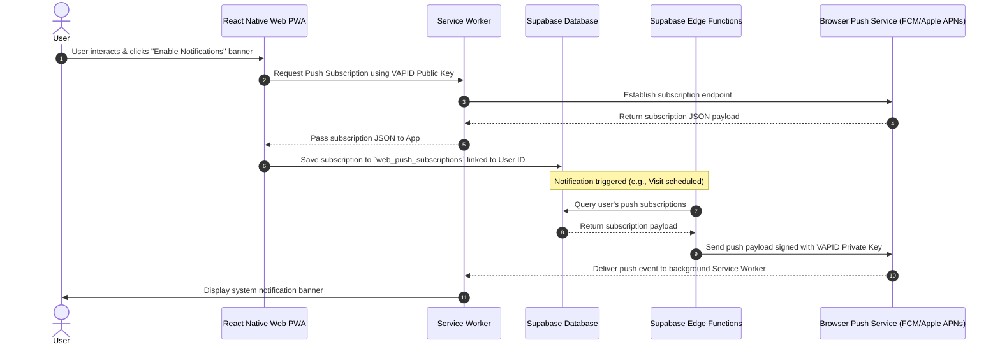

# Implementation Plan: PWA Web Push Notifications

This document outlines the architecture, database schema, code changes, and verification steps required to add Web Push Notifications to the **Society Service Hub** PWA.

---

## 1. Architecture Overview



---

## 2. Database Schema changes

We need a dedicated table to support one-to-many web subscriptions per profile (as a user might install the PWA on multiple devices).

### SQL Migration Script
Create `supabase/migrations/20260621000000_pwa_web_push.sql`:

```sql
-- Table to store web push subscription JSON payloads
CREATE TABLE public.web_push_subscriptions (
  id UUID PRIMARY KEY DEFAULT gen_random_uuid(),
  user_id UUID NOT NULL REFERENCES auth.users(id) ON DELETE CASCADE,
  subscription JSONB NOT NULL, -- Contains endpoint, keys.p256dh, and keys.auth
  created_at TIMESTAMP WITH TIME ZONE DEFAULT timezone('utc'::text, now()) NOT NULL,
  CONSTRAINT unique_user_endpoint UNIQUE (user_id, subscription->>'endpoint')
);

-- Enable RLS
ALTER TABLE public.web_push_subscriptions ENABLE ROW LEVEL SECURITY;

-- Allow users to manage their own subscriptions
CREATE POLICY "Users can manage their own subscriptions"
  ON public.web_push_subscriptions FOR ALL
  USING (auth.uid() = user_id)
  WITH CHECK (auth.uid() = user_id);

-- Create index for performance
CREATE INDEX idx_web_push_subscriptions_user_id ON public.web_push_subscriptions(user_id);
```

---

## 3. Service Worker updates

We need to extend `public/service-worker.js` to handle incoming push events in the background and display them, as well as handling user interaction (clicking the notification).

### Code additions in `public/service-worker.js`:
```javascript
// Background Push Event listener
self.addEventListener('push', (event) => {
  let payload = { title: 'New Update', body: 'Please check the application for updates.' };

  if (event.data) {
    try {
      payload = event.data.json();
    } catch (e) {
      payload = { title: 'New Update', body: event.data.text() };
    }
  }

  const options = {
    body: payload.body,
    icon: '/assets/images/icon.png',
    badge: '/assets/images/favicon.png',
    data: payload.data || {},
    vibrate: [100, 50, 100],
  };

  event.waitUntil(
    self.registration.showNotification(payload.title, options)
  );
});

// Handle Notification Clicks (Routing)
self.addEventListener('notificationclick', (event) => {
  event.notification.close();
  
  const targetUrl = event.notification.data?.url || '/';

  event.waitUntil(
    clients.matchAll({ type: 'window' }).then((clientList) => {
      // If the app is already open, focus it and redirect
      for (const client of clientList) {
        const clientUrl = new URL(client.url);
        if (clientUrl.pathname === '/' && 'focus' in client) {
          if ('navigate' in client) {
            client.navigate(targetUrl);
          }
          return client.focus();
        }
      }
      // Otherwise open a new window
      if (clients.openWindow) {
        return clients.openWindow(targetUrl);
      }
    })
  );
});
```

---

## 4. Frontend implementation

We need a dedicated, polished UI banner prompting PWA users to enable notifications. This banner should only show up on `web` targets when permissions are still in the `'default'` state.

### A. VAPID Key Conversion Helper
A utility function to convert VAPID keys is needed to communicate with the browser's `PushManager`:

```typescript
// file: lib/vapidHelper.ts
export function urlBase64ToUint8Array(base64String: string): Uint8Array {
  const padding = '='.repeat((4 - (base64String.length % 4)) % 4);
  const base64 = (base64String + padding).replace(/-/g, '+').replace(/_/g, '/');
  const rawData = window.atob(base64);
  const outputArray = new Uint8Array(rawData.length);
  for (let i = 0; i < rawData.length; ++i) {
    outputArray[i] = rawData.charCodeAt(i);
  }
  return outputArray;
}
```

### B. Polished Banner Component
Using the app's standard **Verandah Design Language** (e.g. `Verandah.surface`, `Verandah.primary`), here is the component that handles checking status and requesting permission:

```typescript
// file: components/WebPushPromptBanner.tsx
import React, { useState, useEffect } from 'react';
import { StyleSheet, Text, TouchableOpacity, View, Platform } from 'react-native';
import { Ionicons } from '@expo/vector-icons';
import { Verandah } from '../constants/Colors';
import { VerandahRadius } from '../constants/Verandah';
import { useAuth } from '../context/AuthContext';
import { supabase } from '../lib/supabase';
import { urlBase64ToUint8Array } from '../lib/vapidHelper';

export function WebPushPromptBanner() {
  const { user } = useAuth();
  const [visible, setVisible] = useState(false);
  const [submitting, setSubmitting] = useState(false);

  useEffect(() => {
    // Show only on PWA web when permission hasn't been requested or denied yet
    if (Platform.OS === 'web' && 'Notification' in window && user) {
      if (Notification.permission === 'default') {
        setVisible(true);
      }
    }
  }, [user]);

  const handleEnable = async () => {
    if (submitting) return;
    setSubmitting(true);
    try {
      const permission = await Notification.requestPermission();
      if (permission === 'granted') {
        const registration = await navigator.serviceWorker.ready;
        
        const vapidPublicKey = process.env.EXPO_PUBLIC_VAPID_PUBLIC_KEY;
        if (!vapidPublicKey) {
          console.warn('VAPID public key not configured.');
          setVisible(false);
          return;
        }

        const subscription = await registration.pushManager.subscribe({
          userVisibleOnly: true,
          applicationServerKey: urlBase64ToUint8Array(vapidPublicKey)
        });

        // Store subscription in DB
        await supabase.from('web_push_subscriptions').upsert({
          user_id: user?.id,
          subscription: subscription.toJSON(),
        });
      }
      setVisible(false);
    } catch (err) {
      console.error('Failed to register Web Push Subscription:', err);
    } finally {
      setSubmitting(false);
    }
  };

  const handleDismiss = () => {
    setVisible(false);
  };

  if (!visible) return null;

  return (
    <View style={styles.container}>
      <View style={styles.iconWrap}>
        <Ionicons name="notifications-outline" size={20} color={Verandah.primary} />
      </View>
      <View style={styles.textWrap}>
        <Text style={styles.title}>Stay Updated</Text>
        <Text style={styles.subtitle}>Enable notifications to receive alerts about visits and community funds.</Text>
      </View>
      <View style={styles.actionRow}>
        <TouchableOpacity onPress={handleDismiss} style={styles.dismissBtn}>
          <Text style={styles.dismissBtnText}>Later</Text>
        </TouchableOpacity>
        <TouchableOpacity onPress={handleEnable} style={styles.enableBtn} disabled={submitting}>
          <Text style={styles.enableBtnText}>{submitting ? 'Enabling...' : 'Enable'}</Text>
        </TouchableOpacity>
      </View>
    </View>
  );
}

const styles = StyleSheet.create({
  container: {
    backgroundColor: Verandah.card,
    borderWidth: 0.5,
    borderColor: Verandah.borderStrong,
    borderRadius: VerandahRadius.md,
    padding: 16,
    marginHorizontal: 20,
    marginVertical: 12,
    flexDirection: 'column',
    shadowColor: Verandah.primary,
    shadowOffset: { width: 0, height: 4 },
    shadowOpacity: 0.04,
    shadowRadius: 12,
  },
  iconWrap: {
    width: 36,
    height: 36,
    borderRadius: 18,
    backgroundColor: Verandah.accentSoft,
    alignItems: 'center',
    justifyContent: 'center',
    marginBottom: 8,
  },
  textWrap: {
    marginBottom: 12,
  },
  title: {
    fontSize: 16,
    fontWeight: '600',
    color: Verandah.textPrimary,
  },
  subtitle: {
    fontSize: 13,
    lineHeight: 18,
    color: Verandah.textSecondary,
    marginTop: 2,
  },
  actionRow: {
    flexDirection: 'row',
    justifyContent: 'flex-end',
    gap: 12,
  },
  dismissBtn: {
    paddingHorizontal: 16,
    paddingVertical: 8,
  },
  dismissBtnText: {
    fontSize: 13,
    color: Verandah.textSecondary,
    fontWeight: '500',
  },
  enableBtn: {
    backgroundColor: Verandah.primary,
    paddingHorizontal: 16,
    paddingVertical: 8,
    borderRadius: 8,
  },
  enableBtnText: {
    fontSize: 13,
    color: Verandah.primaryFg,
    fontWeight: '500',
  },
});
```

---

## 5. Backend Notification Dispatch (Supabase Edge Function)

When triggering notifications, our background functions will load Deno's Web Push library (or `web-push` NPM library via Deno's npm-compat layer) to send the payloads.

### Code Pattern for sending web notifications:
```typescript
import webpush from "npm:web-push";

// Configuration (Load from Supabase environment)
const VAPID_MAILTO = 'mailto:support@society-service-hub.com';
const VAPID_PUBLIC = Deno.env.get('VAPID_PUBLIC_KEY')!;
const VAPID_PRIVATE = Deno.env.get('VAPID_PRIVATE_KEY')!;

webpush.setVapidDetails(VAPID_MAILTO, VAPID_PUBLIC, VAPID_PRIVATE);

export async function sendWebPush(userId: string, title: string, body: string, deepLinkUrl?: string) {
  // Query all active web subscriptions for this user
  const { data: subscriptions, error } = await supabase
    .from('web_push_subscriptions')
    .eq('user_id', userId);

  if (error || !subscriptions) return;

  const payload = JSON.stringify({
    title,
    body,
    data: { url: deepLinkUrl }
  });

  for (const sub of subscriptions) {
    try {
      await webpush.sendNotification(sub.subscription, payload);
    } catch (err: any) {
      // 404 (Not Found) or 410 (Gone) indicates the subscription expired or was uninstalled
      if (err.statusCode === 410 || err.statusCode === 404) {
        await supabase
          .from('web_push_subscriptions')
          .delete()
          .eq('id', sub.id);
      }
    }
  }
}
```

---

## 6. Verification and Local Testing Setup

To test Web Push notifications locally and prepare for production deployment:

### A. Generate VAPID Keys
Run the following commands locally to generate public/private key pairs:
```bash
npx web-push generate-vapid-keys
```

### B. Environment Variables Setup
1. **Frontend PWA (.env)**:
   Add the public key:
   ```env
   EXPO_PUBLIC_VAPID_PUBLIC_KEY=your_generated_public_key
   ```
2. **Backend (Supabase Secrets)**:
   Set the keys in your Supabase project:
   ```bash
   npx supabase secrets set VAPID_PUBLIC_KEY="your_generated_public_key"
   npx supabase secrets set VAPID_PRIVATE_KEY="your_generated_private_key"
   ```

### C. Testing Steps
1. Deploy the database migrations to Supabase:
   ```bash
   npx supabase db push
   ```
2. Run the PWA locally or on a staging server. Ensure you access it via `localhost` or an `https://` domain (browser push APIs are locked on non-secure http domains except localhost).
3. Install the site as a PWA (click "Install" in the browser search bar).
4. Launch the PWA, log in, and verify that the notification prompt banner appears.
5. Click **Enable** and verify the browser asks for permission.
6. Check your Supabase database table `web_push_subscriptions` to verify a subscription payload has been written.
7. Trigger a notification event and verify the push is received in your system.
