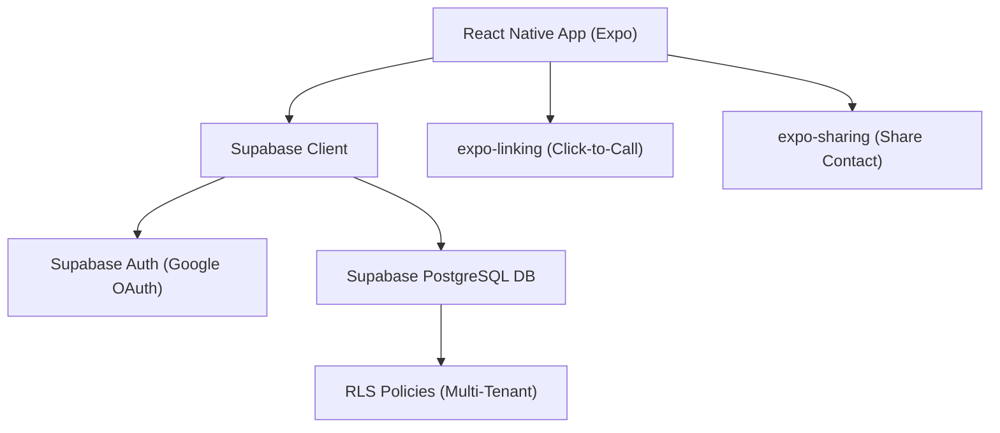

# Society Service Hub — Implementation Plan

> **Historical reference**: this file captures the original build plan and early assumptions. It is not the source of truth for the current app surface. Use `docs/architecture.md`, `docs/features.md`, `docs/copilot-instructions.md`, and `.github/app-summary.md` for the current product state.

A mobile application for gated communities to manage and access trusted service providers, built with **React Native (Expo)** and **Supabase**.

---

## User Review Required

> [!IMPORTANT]
> **Supabase Project Required**: You need to create a Supabase project at [supabase.com](https://supabase.com) and provide the **Project URL** and **Anon Key**. I'll set up the SQL schema, but you need to create the project first.

> [!IMPORTANT]
> **Google Cloud OAuth Setup**: Google Sign-In requires a Google Cloud project with OAuth 2.0 credentials (Web Client ID, Android Client ID, iOS Client ID). This cannot be automated — you'll need to set this up manually in the [Google Cloud Console](https://console.cloud.google.com/).

> [!WARNING]
> **Development Build Required**: Google Sign-In does **not** work in Expo Go. You'll need to use `npx expo run:android` or create an EAS development build to test auth on a real device. For initial development, I'll include a **mock login bypass** so you can test the rest of the app in Expo Go.

---

## Architectdevedeveure Overview



### Multi-Tenant Design
- Each user belongs to a **community** (society)
- `community_id` column on all tenant-aware tables
- Supabase RLS policies enforce data isolation per community
- `community_id` is stored in user's `app_metadata` for secure access in RLS

---

## Proposed Changes

### 1. Project Initialization

#### [NEW] Expo Project

Initialize a new Expo project at `c:\AG_Dev\Society_Service_Hub\Society_Service_Hub` using:
```bash
npx create-expo-app@latest ./ --template tabs --yes
```

**Key Dependencies:**
| Package | Purpose |
|---------|---------|
| `@supabase/supabase-js` | Supabase client |
| `@react-native-google-signin/google-signin` | Native Google Sign-In |
| `expo-secure-store` | Secure session storage |
| `expo-linking` | Click-to-call (`tel:`) |
| `expo-sharing` | Share contact info (used React Native Share instead in final build) |
| `@expo/vector-icons` | Icons (Ionicons) |
| `react-native-toast-message` | Toast notifications |

---

### 2. Supabase Database Schema

#### [NEW] SQL Migration

Three core tables with RLS enabled:

**`communities` table**
```sql
CREATE TABLE communities (
  id UUID PRIMARY KEY DEFAULT gen_random_uuid(),
  name TEXT NOT NULL,
  code TEXT UNIQUE NOT NULL,       -- invite code for joining
  created_at TIMESTAMPTZ DEFAULT now()
);
```

**`profiles` table** (extends `auth.users`)
```sql
CREATE TABLE profiles (
  id UUID PRIMARY KEY REFERENCES auth.users(id) ON DELETE CASCADE,
  full_name TEXT,
  avatar_url TEXT,
  community_id UUID REFERENCES communities(id),
  created_at TIMESTAMPTZ DEFAULT now()
);
```

**`service_providers` table**
```sql
CREATE TABLE service_providers (
  id UUID PRIMARY KEY DEFAULT gen_random_uuid(),
  community_id UUID NOT NULL REFERENCES communities(id),
  created_by UUID NOT NULL REFERENCES auth.users(id),
  name TEXT NOT NULL,
  phone TEXT NOT NULL,
  category TEXT NOT NULL,            -- Maid, Electrician, Plumber, etc.
  description TEXT,
  flat_block TEXT,                    -- optional
  avg_rating NUMERIC(2,1) DEFAULT 0,
  rating_count INTEGER DEFAULT 0,
  is_favorite BOOLEAN DEFAULT false, -- per-user favorites handled separately
  created_at TIMESTAMPTZ DEFAULT now(),
  updated_at TIMESTAMPTZ DEFAULT now()
);
```

**`favorites` table** (per-user favorites)
```sql
CREATE TABLE favorites (
  id UUID PRIMARY KEY DEFAULT gen_random_uuid(),
  user_id UUID NOT NULL REFERENCES auth.users(id) ON DELETE CASCADE,
  provider_id UUID NOT NULL REFERENCES service_providers(id) ON DELETE CASCADE,
  created_at TIMESTAMPTZ DEFAULT now(),
  UNIQUE(user_id, provider_id)
);
```

**`ratings` table** (one rating per user per provider)
```sql
CREATE TABLE ratings (
  id UUID PRIMARY KEY DEFAULT gen_random_uuid(),
  user_id UUID NOT NULL REFERENCES auth.users(id) ON DELETE CASCADE,
  provider_id UUID NOT NULL REFERENCES service_providers(id) ON DELETE CASCADE,
  rating INTEGER NOT NULL CHECK (rating >= 1 AND rating <= 5),
  created_at TIMESTAMPTZ DEFAULT now(),
  UNIQUE(user_id, provider_id)
);
```

**RLS Policies** — All tables will have RLS enabled. Key policies:
- `service_providers`: Users can only read/write providers within their `community_id`
- `favorites`: Users can only manage their own favorites
- `ratings`: Users can insert/update their own ratings, read all within community
- Community ID is read from `auth.jwt() -> 'app_metadata' ->> 'community_id'`

---

### 3. File Structure

```
app/
├── _layout.tsx                    # Root layout (auth state check)
├── login.tsx                      # Login screen
├── community-select.tsx           # Community join/create screen
├── (tabs)/
│   ├── _layout.tsx                # Tab bar layout
│   ├── index.tsx                  # Home — provider list
│   ├── favorites.tsx              # Favorites tab
│   └── profile.tsx                # Profile / Settings
├── provider/
│   ├── [id].tsx                   # Provider detail screen
│   └── add.tsx                    # Add/Edit provider form
│
lib/
├── supabase.ts                    # Supabase client setup
├── auth.ts                        # Auth helpers (Google Sign-In)
├── types.ts                       # TypeScript types
│
components/
├── ProviderCard.tsx               # Provider list card
├── CategoryFilter.tsx             # Horizontal category filter
├── SearchBar.tsx                  # Search input
├── RatingStars.tsx                # Star rating display/input
├── EmptyState.tsx                 # Empty list state
│
constants/
├── categories.ts                  # Service categories list
├── colors.ts                      # Theme colors
│
context/
├── AuthContext.tsx                 # Auth state provider
```

---

### 4. Screens

#### Screen 1: Login (`app/login.tsx`)
- App logo and tagline
- "Sign in with Google" button using `@react-native-google-signin/google-signin`
- Auth flow: Native Google Sign-In → get `idToken` → `supabase.auth.signInWithIdToken()`
- On success, check if user has a `community_id` → route to Home or Community Select

#### Screen 2: Community Select (`app/community-select.tsx`)
- Shown once after first login (if no community assigned)
- Two options: **Join existing community** (enter invite code) or **Create new community**
- Sets `community_id` in user's profile and `app_metadata`

#### Screen 3: Home (`app/(tabs)/index.tsx`)
- **Search bar** at top (search by name or service type)
- **Category filter** chips (horizontal scroll: All, Maid, Electrician, Plumber, AC Technician, etc.)
- **Provider list** (FlatList) showing: name, category badge, phone, rating stars
- **FAB button** to add new provider
- Pull-to-refresh
- Tap card → navigate to detail screen

#### Screen 4: Add/Edit Provider (`app/provider/add.tsx`)
- Form fields: Name*, Phone*, Category* (dropdown/picker), Description, Flat/Block
- Category picker with predefined options
- Validation (name and phone required)
- Save → insert/update to Supabase → navigate back

#### Screen 5: Provider Detail (`app/provider/[id].tsx`)
- Full provider details display
- **Call button** (primary action) — `Linking.openURL('tel:...')`
- **Share button** — share provider info as text via native share sheet
- **Favorite toggle** (heart icon)
- **Rating** — tap to rate (1-5 stars)
- **Edit/Delete** buttons (only for the user who created the entry)

#### Screen 6: Favorites (`app/(tabs)/favorites.tsx`)
- List of all favorited providers
- Same card layout as home screen

#### Screen 7: Profile (`app/(tabs)/profile.tsx`)
- User info (name, email, avatar from Google)
- Community name and invite code (for sharing)
- Sign out button
- App version

---

### 5. Design System

#### Color Palette (Configured to use Light Mode per user request)
- Font: `Inter` (via standard system sans-serif integration)
- UI Patterns: Card elevations, floating action buttons, clean iOS/Android native feel.

---

## Verification Plan

### Automated Tests
- Run `npx expo lint` to verify code quality
- Run `npx tsc --noEmit` to verify TypeScript types
- Start dev server with `npx expo run:android` and verify no build errors

### Manual Verification
1. **Auth Flow**: Sign in with Google → profile created → community select → home screen
2. **CRUD**: Add a provider → appears in list → edit details → delete
3. **Search/Filter**: Search by name → results filter; tap category chip → filters list
4. **Call**: Tap call button → phone dialer opens with correct number
5. **Share**: Tap share → native share sheet with provider info
6. **Favorites**: Toggle favorite → appears in favorites tab
7. **Rating**: Tap stars → rating saved → average updates
8. **Multi-tenant**: Two users in different communities cannot see each other's providers

